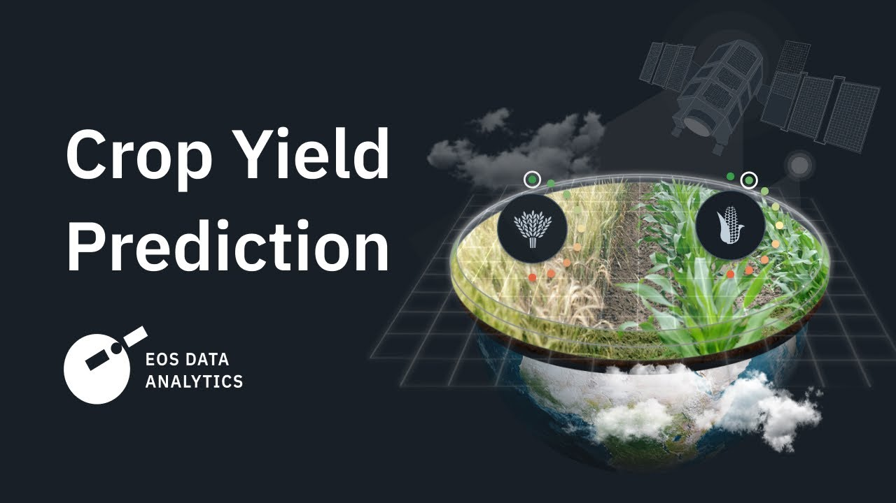

# Advanced Crop Yield Prediction System

An AI-powered agricultural platform for data analysis, crop yield prediction, and intelligent farming assistance.



## Overview

This application combines machine learning with agricultural science to provide farmers, researchers, and agricultural professionals with powerful tools for understanding and predicting crop yields. The system offers both web and mobile interfaces, enabling access from various devices.

## Key Features

### Data Analytics
- **Data Exploration**: Analyze agricultural datasets with interactive visualizations
- **Feature Analysis**: Understand relationships between environmental factors and crop yields
- **Statistical Reports**: Generate detailed statistical reports on crop performance

### Machine Learning
- **Model Training**: Train custom ML models on your agricultural data
- **Yield Prediction**: Predict crop yields based on environmental factors and historical data
- **Performance Metrics**: Track and compare model performance metrics

### Crop Encyclopedia
- **Crop Information**: Access detailed information about various crops
- **Growing Conditions**: Learn about optimal conditions for different crops
- **Nutritional Data**: View nutritional information for agricultural produce

### AI Integration
- **Gemini AI Assistant**: Get AI-powered insights using Google's Gemini
- **Crop Image Analysis**: Upload images for health assessment and disease identification
- **Custom AI Queries**: Ask agricultural questions and receive expert-level responses

### Mobile Support
- **Android Application**: Access core features on Android devices
- **Offline Mode**: Use essential features without internet connection
- **Image Upload**: Capture and analyze crop images directly from your device

## Installation

### Web Application (Streamlit)

1. Clone the repository
   ```
   git clone https://github.com/yourusername/crop-yield-prediction.git
   cd crop-yield-prediction
   ```

2. Install dependencies
   ```
   pip install -r requirements.txt
   ```

3. Run the web application
   ```
   streamlit run app.py
   ```

### Android Application

1. Ensure you have the prerequisites
   - Python 3.7+
   - For Windows: WSL (Windows Subsystem for Linux)
   - For Linux/WSL: Required packages

2. Install required Python packages
   ```
   pip install kivy==2.1.0 kivymd pillow numpy pandas matplotlib buildozer kivy_garden
   garden install matplotlib
   ```

3. Build the APK
   ```
   buildozer -v android debug
   ```

4. Install the APK on your Android device
   - The APK will be in the `bin/` directory

## System Requirements

### Web Application
- **Python**: 3.9+
- **Memory**: 4GB RAM minimum (8GB recommended)
- **Storage**: 500MB for application, 1GB+ for datasets
- **Browser**: Chrome, Firefox, Safari, Edge (latest versions)

### Android Application
- **Android**: 5.0+ (API level 21+)
- **Storage**: 100MB minimum
- **Permissions**: Internet, Storage, Camera (for image analysis)

## Technologies Used

### Core Technologies
- **Python**: Core programming language
- **Streamlit**: Web application framework
- **Kivy/KivyMD**: Mobile application framework
- **Google Generative AI**: For AI assistant features

### Data Processing & Analysis
- **Pandas & NumPy**: For data processing and manipulation
- **Matplotlib, Seaborn, Plotly**: For data visualization
- **GeoPandas**: For geospatial data handling

### Machine Learning
- **Scikit-learn**: For traditional ML models
- **XGBoost, LightGBM**: For gradient boosting models
- **TensorFlow, PyTorch**: For deep learning models

## API Integrations

To use the Gemini AI features, you'll need to:

1. Obtain a Google Generative AI API key from [Google AI Studio](https://makersuite.google.com/)
2. Enter the API key in the Gemini AI Assistant section
3. Enable the required API permissions for your project

## Data Sources

The application can work with various agricultural data sources:
- CSV files with crop yield historical data
- Climate data (temperature, rainfall, humidity)
- Soil quality measurements
- Satellite imagery data

## Usage Examples

### Predicting Crop Yields
1. Navigate to the "Yield Prediction" section
2. Upload your historical crop data
3. Select the environmental factors to consider
4. Choose a prediction model
5. Generate and view yield predictions

### Using the AI Assistant
1. Go to the "Gemini AI" section
2. Enter your API key
3. Ask agricultural questions or upload crop images
4. Receive AI-powered insights and recommendations

### Mobile App
1. Open the app on your Android device
2. Navigate to the Crop Encyclopedia
3. Select a crop to view detailed information
4. Use the camera to capture and analyze crop images

## Contributing

Contributions are welcome! Please feel free to submit a Pull Request.

1. Fork the repository
2. Create your feature branch (`git checkout -b feature/amazing-feature`)
3. Commit your changes (`git commit -m 'Add some amazing feature'`)
4. Push to the branch (`git push origin feature/amazing-feature`)
5. Open a Pull Request

## License

This project is licensed under the MIT License - see the LICENSE file for details.

## Contact

For any inquiries, please open an issue in this repository.

## Acknowledgments

- Special thanks to all contributors
- Agricultural data provided by [relevant organizations]
- Additional libraries and resources used in this project 